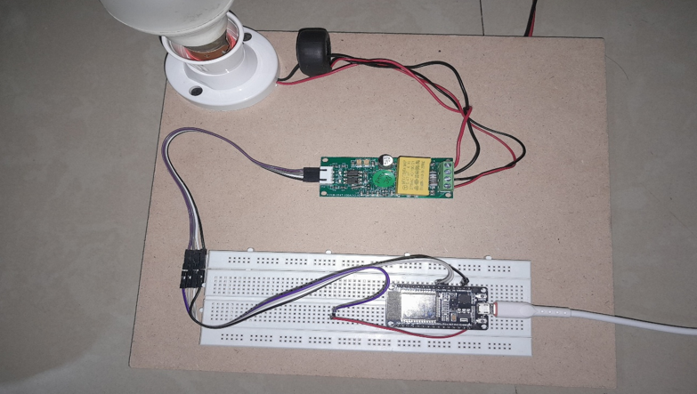

# IoT AC Energy Meter using ESP32 & PZEM-004T

## Overview
This project is an IoT-based AC Energy Monitoring System built using ESP32 and the PZEM-004T v3.0 module. It measures real-time electrical parameters and displays them on a web-based dashboard with live graph visualization.

## Key Features
- Real-time monitoring of Voltage, Current, Power, Energy, Frequency, and Power Factor
- ESP32-based WiFi Access Point (no external router required)
- Async Web Server for fast and non-blocking performance
- Live dashboard with smooth dynamic graphs
- Data refresh rate ~800ms for near real-time updates
- Custom frontend using HTML, CSS, and JavaScript

## Technologies Used
- Embedded C (Arduino Framework)
- ESP32 WiFi
- PZEM-004T Energy Monitoring Module
- ESPAsyncWebServer
- HTML, CSS, JavaScript (Frontend)

## System Architecture
- PZEM-004T measures electrical parameters
- ESP32 processes sensor data
- Data served via HTTP API (/data endpoint)
- Web dashboard fetches and visualizes data dynamically

## Working
The ESP32 reads real-time values from the PZEM-004T module via UART communication. It hosts a local web server and serves a dashboard. The frontend fetches data from the ESP32 every 800ms and updates values along with smooth graphical representation using canvas.

## Demo

## Project Structure
- code.ino → Main ESP32 program
- images/ → Circuit and output screenshots

## Output
- Real-time electrical parameter display
- Smooth graph visualization for each parameter
- Responsive web dashboard accessible via local network

## Future Scope
- Cloud integration (ThingSpeak / Firebase)
- Mobile application support
- Historical data storage and analytics
